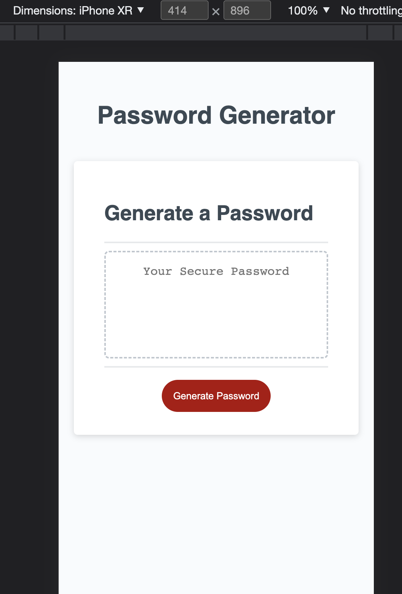
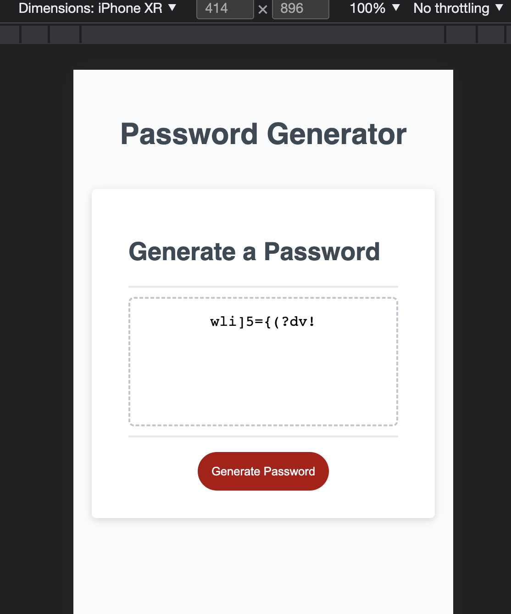
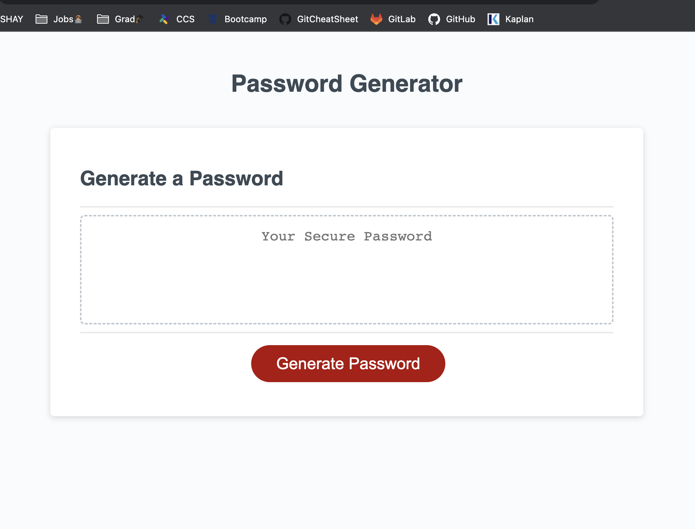
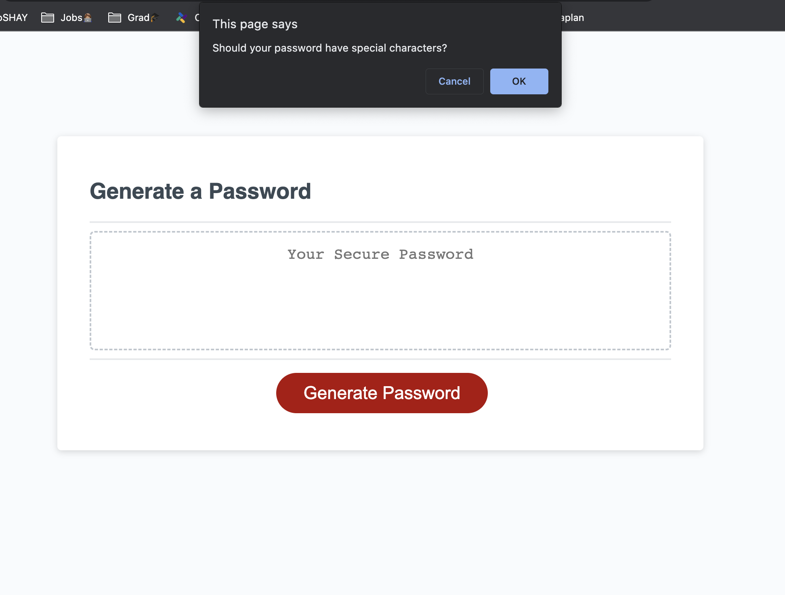

## Password Generator

## Description
A password generator that fullfills the criteria given by the user including the length of the password and what kind of characters would be in the password.

### View in mobile mode from iPhone:

### View in desktop:

## Installation
Extra equipment is not needed to view this project.

## Usage
This site provides an automated manner to create passwords at random, and therefore increase their security.

## Project status
Completed.

## Links
Deployed site: https://shannyan.github.io/three-pwdgen/

Link to Repo: https://github.com/ShannyaN/two-port
